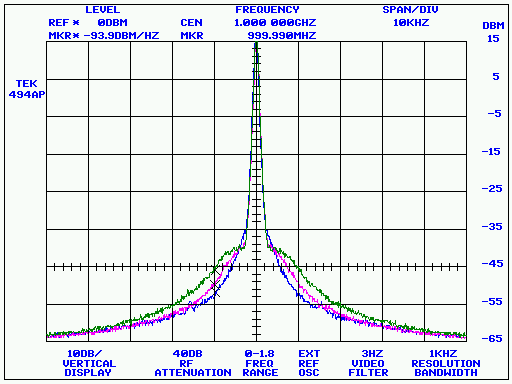
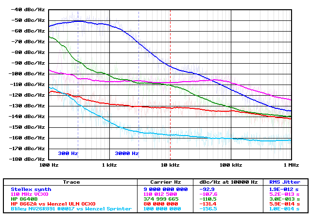
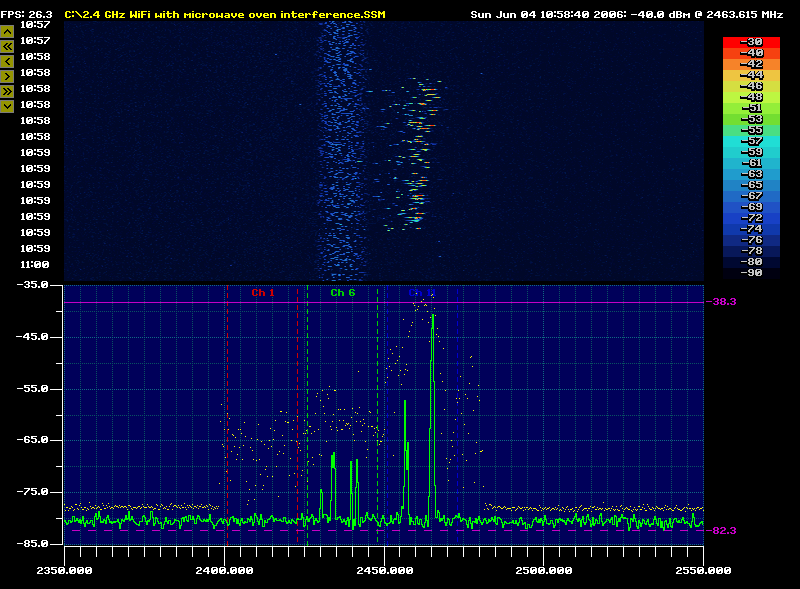
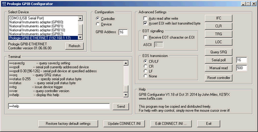
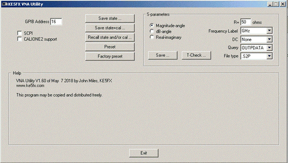
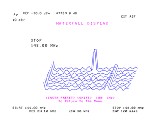

# Welcome to the GPIB Toolkit!



The **GPIB Toolkit** is a collection of free Windows utilities that will help you make and record research-quality measurements with GPIB-based electronic test equipment.  

This is version 1.994 of the Toolkit, released April 27, 2025.

[Download the GPIB Toolkit (4 MB)](http://www.ke5fx.com/gpib/setup.exe)

For troubleshooting help and additional application notes, check the [FAQ](./faq.htm).

The GPIB Toolkit is provided with full C++ source code for public- and private-sector, educational and Amateur Radio / hobbyist use. Comments and feedback are always welcome.

John Miles, KE5FX  
[john@miles.io](mailto:john@miles.io)

> Note: As of July 2016, some false positives have been reported from certain virus scanners including Microsoft Security Essentials/Windows Defender. As long as the confirmation dialog includes a valid [signature](http://www.ke5fx.com/secwarn.png) for Miles Design LLC, the file's code signature is intact, and you can safely disregard these warnings. This issue appears to have been resolved in the 1.225.1983.0 antivirus definition update.

---

## 7470

7470.EXE is a Win32-based emulator for the HP 7470A plotter. See its [User Guide](./7470.htm) for more information.

---

## PN



PN.EXE is an automated phase-noise measurement utility for HP, Tektronix, and Advantest spectrum analyzers.
See its [User Guide](./pn.htm) for more information.

---

## SSM



SSM.EXE is a spectrum surveillance monitor application for HP, Tektronix, and Advantest spectrum analyzers, as well as Signal Hound USB spectrum analyzers. See its [User Guide](./ssm.htm) for more information.

---

## GPIB CONFIGURATOR

PROLOGIX.EXE allows you to select and configure a Prologix GPIB-USB or GPIB-ETHERNET adapter for use with the GPIB Toolkit applications. It can also be used to select a National Instruments adapter, or to configure the GPIB Toolkit to work with an otherwise-unsupported TCP/IP or serial adapter.



Most of the GPIB Toolkit applications support both Prologix and National Instruments GPIB adapters. By default, the Toolkit expects to find a National Instruments device at GPIB0. When using a Prologix adapter, it's necessary to edit the CONNECT.INI file to tell the GPIB Toolkit where to find the Prologix adapter's virtual serial port or network address.

This task is easy to accomplish with PROLOGIX.EXE. Simply run the program, select the Prologix or National Instruments adapter in the device list, and press the **Update CONNECT.INI** button. (Be sure to exit from PROLOGIX.EXE before attempting to run any other GPIB Toolkit application.)

You can use the **Edit CONNECT.INI** button in PROLOGIX.EXE as a convenient way to modify your existing GPIB configuration manually, regardless of whether or not you're using a Prologix adapter. Editing the file also gives you access to additional options for troubleshooting and optimization. See the comments in CONNECT.INI for more information.

Beginning with the V1.50 release of the GPIB Toolkit, it is no longer necessary to select Device or Controller mode in PROLOGIX.EXE unless you wish to use the optional Terminal or Advanced Settings controls. Each Toolkit application will configure the Prologix adapter's mode and address settings as needed. 

```text
           Usage examples:
           
           prologix                 Run with no command-line options for normal enumeration of all 
                                    Prologix GPIB-USB, GPIB-ETHERNET, and National Instruments adapters

           prologix -noni           Don't attempt to enumerate National Instruments adapters (useful if
                                    error messages are reported after a partial NI488.2 driver uninstallation)

           prologix -nonet          Don't issue UDP broadcasts to detect Prologix GPIB-ETHERNET adapters
```

---

## VNA



VNA.EXE allows you to save and load control/calibration states for HP 8753, HP 8510, and HP 8720-series vector network analyzers. Touchstone .S2P files can also be acquired from these models, as well as from the FieldFox portables. VNA.EXE can eliminate the need for a disk drive in many cases.

* **Release 1.00 of 5-Feb-13**
  * Fixed some compatibility issues with Prologix GPIB-USB and GPIB-ETHERNET adapters
* **Release 1.10 of 23-May-13**
  * Added "Save .S2P file" button
* **Release 1.20 of 15-Jun-13**
  * .S2P export functionality verified compatible with HP 8510B. Renamed 8753.EXE to VNA.EXE to reflect support for multiple instruments
* **Release 1.30 of 28-Aug-13**
  * Added the ability to export .S2P data in dB/angle or real/imaginary format as well as the default magnitude/angle format
  * Added the ability to specify the reference resistance for saved .S2P files
* **Release 1.40 of 28-Sep-14**
  * Added progress indicator for lengthy operations
  * On 8753-series VNAs, the .S2P export function now restores the previously-active parameter when finished. Previous versions left S22 active.
  * Improved reliability of .S2P export function when using Prologix adapters
* **Release 1.50 of 30-Sep-14**
  * Support for saving/recalling instrument states and calibration data on HP 8510 series VNAs (tested on HP 8510C)
  * Added *Factory preset* button
  * More reliability improvements for Prologix adapters
* **Release 1.51 of 5-Oct-14**
  * .S2P export function now supports all sweep types on 8753- and 8720-series VNAs, including log and list sweeps. Only linear sweeps are supported on 8510 models.
  * *Factory preset* button now supports HP 8510A/B analyzers
* **Release 1.52 of 23-Dec-14**
  * Fixed bug introduced in V1.51 that caused .S2P frequency values in linear sweeps to begin at 0 Hz rather than the start frequency
* **Release 1.53 of 15-Jan-15**
  * Added support for Hz, kHz, and MHz frequency values in .S2P files
* **Release 1.54 of 13-Jul-15**
  * Added T-Check function to characterize calibration uncertainty
  * Added .S2P support for Agilent/Keysight FieldFox portable VNAs (tested with N9923A)
  * Added optional support for initial DC entry in .S2P files
* **Release 1.55 of 14-Jul-15**
  * Additional functionality (spline interpolation, multiple .S2P file display, etc.) added to T-Check viewer
* **Release 1.56 of 25-Apr-16**
  * CALIONE2 (one path two-port) calibration type supported for 8753 series
* **Release 1.57 of 29-Oct-16**
  * Added check box in order to avoid lockups on instruments that don't support CALIONE2, such as HP 8719C
  * .S2P support added for 8722 series
* **Release 1.58 of 28-Sep-17**
  * Added "Save .S1P file" button
* **Release 1.60 of 7-May-17**
  * New options added to select OUTPFORM data and save S22 data to .S1P files
* **Release 1.61 of 30-Jul-18**
  * Added HP 8703A/B support
* **Release 1.62 of 2-Oct-18**
  * Added option to save S21 data to .S1P files
* **Release 1.63 of 26-Mar-20**
  * Fixed issue that caused the T-Check viewer to fail to render certain .S2P files
* **Release 1.64 of 18-Jan-21**
  * When saving a Touchstone file, the magnitude of S11 and S22 at DC is now set to 0.0 instead of 1.0 when "Unity mag" is selected
* **Release 1.65 of 22-Feb-21**
  * Added 'Initiate single sweep' checkbox option. This box is checked by default to maintain the previous behavior, but may be unchecked when necessary to save S parameters without triggering a new sweep.

---

## SATRACE

**SATRACE.EXE** can be thought of as a console-oriented version of [SSM](./ssm.htm). It requests one or more traces from any spectrum analyzer supported by SSM, and writes them to stdout as lists of comma-separated frequency/amplitude pairs.  

SATRACE's command-line parameters are very similar to those supported by SSM.

```text
           Usage: satrace <address> [<options>...]
           
           Examples using GPIB address 18:

           satrace 18               Auto-identify analyzer at GPIB address 18 and acquire
                                    a single trace from it
           
           satrace -sa44            Special option required for use with USB-SA44/B or    
                                    USB-SA124A Signal Hound (No GPIB address is needed)
           
           satrace 18 -856xa        Special option required for use with HP8566A-HP8568A
           
           satrace 18 -8569b        Special option required for use with HP8569B/8570A
           
           satrace 18 -358xa        Special option required for use with HP3588A/3589A
           
           satrace 18 -3585         Special option required for use with HP3585A/B
           
           satrace 18 -advantest    Special option required for use with supported 
                                    Advantest R3200/R3400-series analyzers
           
           satrace 18 -r3261        Special option required for use with R3261/R3361
           
           satrace 18 -scpi         Special option required for use with Agilent E4400-
                                    series and other SCPI-compatible analyzers
           
           satrace 18 -f            Favor speed over resolution, CRT updates, or other
                                    factors (if supported)
           
           satrace 18 -t            Disable GPIB timeout checking during long sweeps
           
           satrace 18 -ao:-7        Add -7 dBm to all reported amplitude values
           
           satrace 18 -fo:150000000 Add 150 MHz to all reported frequency values
           
           satrace 18 -reps:15      Acquire 15 successive traces (0 = run until keypress)

           satrace 18 -trace:"TA"   Acquire from specified trace (HP 8568B/8566B only,
             "                      default="TA")
           
           satrace 18 -header       Display time/datestamp and available analyzer control
                                    settings
           
           satrace 18 -lf           Separate frequency/amplitude pairs with linefeeds
                                    rather than commas
           
           satrace 18 -spline:800   Resample trace using cubic spline reconstruction to
                                    generate (e.g.) 800 points, regardless of the
                                    analyzer's trace array width
           
           satrace 18 -point:128    Resample trace using point-sampled values
           
           satrace 18 -min:128      Resample trace using minimum bucket values when more
                                    source points than requested are available
                                    (otherwise use spline)
           
           satrace 18 -max:128      Resample trace using maximum bucket values when more
                                    source points than requested are available
                                    (otherwise use spline)
           
           satrace 18 -avg:128      Resample trace using averaged bucket values when more
                                    source points than requested are available
                                    (otherwise use spline)
           
           satrace 18 -connect:"xxx" 
                                    Specify GPIB command string to be issued when 
                                    initially connecting to instrument
           
           satrace 18 -disconnect:"xxx" 
                                    Specify GPIB command string to be issued when
                                    disconnecting prior to program termination
           
           satrace 18 -856xa -f     Example using multiple options
```

Like SSM, SATRACE does not normally attempt to control or configure the spectrum analyzer. Traces are acquired based on the current front-panel settings such as center frequency, reference level, resolution bandwidth, and so forth. However, SATRACE does provide limited control options for certain analyzer models. These options are shown below.

```text
           Additional control options supported by Signal Hound only:
           
                -RL:-40             Specify reference level in dBm (default = -30)
                -CF:90.3E6          Specify center frequency in Hz (default = 900 MHz)
                -span:10E6          Specify span in Hz (default = 1 MHz)
                -start:88E6         Specify sweep start frequency (default = 899 MHz)
                -stop:108E6         Specify sweep stop frequency (default = 901 MHz)
                -bins:64            Specify FFT kernel size (power of 2 from 16 to 256,
                                    default = 128)
                -sens:2             Specify sensitivity factor (default = 2, range 0-2)
                -RFATT:10           Specify RF attenuation in dB (0-15 dB in 5-dB steps,
                                    default = 0)
```

In most cases, SATRACE's output will be "piped" to another file or application. For example, the command

```text
c:\program files\ke5fx\gpib>satrace 18 -reps:100 -point:500 >temp.txt
```

will read 100 successive traces from the analyzer at GPIB address 18, point-sample them to generate 500 (Hz,dBm) value pairs for each trace, and write the resulting comma-separated value lists to the file **temp.txt**.

For more details on trace resampling, see the [FAQ](./faq.htm#resamp) ("**How do the trace-resampling options in SATRACE and SSM work?**").

* **Release 1.01 of 25-Jul-08**
  * Tektronix 49x/275x analyzers now use low-resolution mode by default to avoid checksum errors
* **Release 1.02 of 08-Sep-08**
  * Added support for MAX SPAN traces from Tektronix 49x/275x and 271x analyzers
* **Release 1.03 of 20-Oct-08**
  * Added support for the Advantest R3132 family of spectrum analyzers, including the R3132, R3162, R3172, and R3182 models
  * Fixed bug that could cause assertion failures on Agilent E4400-series instruments
* **Release 1.04 of 08-Apr-09**
  * Added support for the Advantest R3261/R3361/R3265/R3271-family of spectrum analyzers
* **Release 1.05 of 30-May-11**
  * Added support for the Agilent E4406A vector signal analyzer
* **Release 1.06 of 31-Jul-12**
  * Added support for Anritsu MS2650/MS2660 series (via -scpi option)
  * Added support for the USB-SA44/B and USB-SA124A Signal Hound spectrum analyzers
* **Release 1.07 of 28-Aug-13**
  * Added SCPI support for Agilent N991x- and N993x-series FieldFox RF analyzers in spectrum analyzer mode. For more information on direct connectivity to Ethernet devices, search the [FAQ](http://www.ke5fx.com/gpib/faq.htm) for *FieldFox*.
* **Release 1.08 of 28-Jul-15**
  * Fixed a byte-order issue that could cause invalid data to be acquired from a FieldFox analyzer 
* **Release 1.09 of 4-Aug-16**
  * Added support for Advantest R3131 (via -advantest option)
* **Release 1.10 of 29-Jul-21**
  * Added -trace command line option for HP 8566B/8568B analyzers
  * Fixed bug that caused -connect and -disconnect options to fail with GPIB commands containing spaces
* **Release 1.11 of 24-Nov-22**
  * Fixed bug that caused incompatibility with R&S FSU in SCPI mode
* **Release 1.12 of 27-Apr-25**
  * Added support for HP 89410A and 8944xA vector signal analyzers

---

## SGENTEST

**SGENTEST.EXE** tests HP signal generators (8656A/B, 8757A-D, 8642B/M, 8662A/8663A, 8672A and others) by programming randomly-chosen frequency and amplitude settings. Output signals are then verified by an HP 8566A/B, 8568A/B, or 8560A/E-series spectrum analyzer.

```text
Usage: sgentest <analyzer address> <generator address> [<options> ...]

Available options (with default or example values):

         -fmax:1.2E9   .... Maximum test frequency = 1200 MHz
         -fmin:10E3    .... Minimum test frequency = 10 kHz
         -amin:-90     .... Minimum test power = -90 dBm
         -amax:10      .... Maximum test power = 10 dBm
         -loss:1.0     .... Interconnect loss in dB at fmax
         -ftol:200     .... Frequency tolerance = +/- 200 Hz
         -atol:2       .... Amplitude tolerance = +/- 2 dBm
         -wait:0.25    .... Wait 250 milliseconds after programming generator
         -8662         .... Check for HP 8662A/8663A hardware errors
         -8672         .... Compatibility mode for HP 8672A signal generators
         -8560         .... Compatibility mode for certain HP 8560A/B/E portable analyzers
         -log:filename .... Log output to filename
         -trials:1000  .... Stop after 1000 trials
         -verbose      .... Display/log all trials, not just failures
         -srand:500    .... Seed random # generator with integer
         -stime        .... Seed random # generator with time() function

Notes:

- Minimum test power must be sufficient to yield good amplitude measurements
- Numeric arguments are reals, and may use scientific notation
- 8662A/8663A hardware error checks are disabled by default
- Some 8560A/B/E-series portables may require -8560 switch for compatibility
  (which inhibits use of KSX and KSb commands for amplitude correction and
  positive-peak detection)
- Test will run indefinitely if -trials is 0 (or not specified)
- Default -loss value is based on 15 feet of LMR-400 and two N connectors at fmax=1.2E9
- When using the -8672 option, set the front panel RANGE control to minimum power (-110 dBm) to avoid false readings

Example to test HP 8663A at address 19 with analyzer at address 18, using 15 feet of LMR-400 cable (1.0 dB loss) with N connectors (0.15 dB each):

   sgentest 18 19 -fmax:2559E6 -amax:19 -8662 -loss:1.3
  
Example to test HP 8672A at address 19:

   sgentest 18 19 -8672 -fmax:18E9 -fmin:2E9 -amax:8 -amin:-50 -atol:4 -loss:4
```

---

## Miscellaneous Win32 Console Applications

By default, the following utilities are installed with the rest of the GPIB Toolkit executables in the installation directory, normally **C:\Program Files\KE5FX\GPIB** or **C:\Program Files (x86)\KE5FX\GPIB**. In most cases you can obtain usage notes by running each program with no command-line arguments.

* **PARSE.EXE** is a simple command-line utility that allows you to inspect HP-GL files by dumping their instructions to stdout.
* **QUERY.EXE** is a standalone GPIB query utility intended for diagnostic purposes and batch/shortcut files.
* **TALK.EXE** is a standalone GPIB command-transmission utility intended for diagnostic purposes and batch/shortcut files.
* **LISTEN.EXE** is a standalone GPIB data-reception utility for ASCII traffic, intended for diagnostic purposes and batch/shortcut files.
* **BINQUERY.EXE** is a standalone GPIB query utility intended for diagnostic purposes and batch/shortcut files. It illustrates how to retrieve arbitrarily-large binary data blocks from GPIB instrumentation.
* **PSAPLOT.EXE** retrieves .GIF screenshots from an Agilent PSA-series spectrum analyzer (tested on E4443A with firmware version A.11.21). It also works with the E4406A vector signal analyzer and possibly with other E4XXX-series models.
* **GPS.EXE** is an example program for the GNSS.DLL library. It displays incoming latitude, longitude, and altitude fixes. GNSS.DLL provides a C API for NMEA-compatible GPS receivers such as the u-blox [LEA-6](http://www.u-blox.com/en/gps-modules/pvt-modules/lea-6-family.html) series.
* **5071A.EXE** sets the clock on an HP 5071A / Symmetricom 5071A primary frequency standard from a specified NTP server.
* **5345A.EXE** and **5370.EXE** are two example programs that show how to communicate via GPIB with the HP 5345A and HP 5370A/B frequency counters, respectively. They are meant to be modified and recompiled as needed.
* **8672A.EXE** programs the output frequency and (optionally) power level for the HP 8672A microwave signal generator.
* **DTS2070.EXE** demonstrates capture of timing data from a Wavecrest DTS2070 timing analyzer. Like the HP counter utilities it is meant to be modified as needed.
* **ATTEN_3488A.EXE** demonstrates remote control of RF step attenuators via a HP 3488A / HP 44170A programmable switch
* **44471A.EXE** supports relay control on HP 3488A / HP 44471A
* **T962.EXE** reads data from a Puhui T962-series oven with ESTechnical firmware. (experimental)
* **TXCOM.EXE** transmits an arbitrary string to a COM port, without resetting devices such as Arduinos by asserting DTR
* **MTIE.EXE** computes ADEV and MTIE statistics for phase data
* **DSO6000.EXE** retrieves voltage data from a trace captured on an Agilent DSO/MSO6000A-series oscilloscope. If an output filename is supplied on the command line, the data will be written as a series of double-precision binary values; otherwise, the voltage values will be printed to stdout. DSO6000.EXE assumes that a SINGLE sweep has run to completion, and that the oscilloscope is in STOP mode (STOP/RUN button illuminated red.) It was tested on an MSO6054A, and may or may not be compatible with other Agilent models such as the DSO/MSO5000A series.
* **CAL_TEK490.EXE** contains various calibration aids from the Tektronix 492P service manual. Run the program for a menu of available calibration routines.
* **DATAQ.EXE** acquires data from a DataQ DI-154RS or DI-194 serial DAQ adapter.
* **SSMDUMP.EXE** and **SSMCHAN.EXE** show how to access the row data from an .SSM file.
* **ECHOCLIENT.EXE** and **ECHOSERVER.EXE** are intended for troubleshooting and benchmarking TCP/IP connections. These utilities communicate over port 4242. (Note that benchmark results obtained from these programs are normally limited by the GPIB Toolkit's network layer, rather than by the connection itself.)
* **PRINTHPG.EXE** sends a plotter data file (.PLT, .HPG, etc.) to the default DOS printer (PRN device). This printer should be an HP LaserJet or compatible model that supports legacy HP-GL commands. Other printers can be used by 7470.EXE, but the bitmaps printed by 7470.EXE will lack the resolution and fidelity obtainable by sending the plotter file directly to a genuine HP-GL-compatible printer. 

  If you have a LaserJet and want the best-quality black-and-white output possible, PRINTHPG.EXE is the way to go. Note that even LaserJets don't support some HP-GL features, like UC (User Character) opcodes! If your instrument relies on these, you'll need to use 7470.EXE to render its plots and print them as fixed-resolution bitmaps.
* **TCPLIST.EXE** transmits a string to a specified TCP/IP address and listens for a reply. Command-line options specify the timeout interval, EOS character, and the number of ASCII text lines expected in response. TCPLIST.EXE is handy for accessing instruments that support Telnet connections or other simple ASCII-based protocols. (Deprecated in favor of READINST.EXE, described below.)
* **READINST.EXE** is similar to TCPLIST but offers several more command-line options. In most cases, READINST should be used in preference to TCPLIST.
* **READPKR.EXE** fetches pressure readings from an Inficon PKR251 or compatible sensor using HP 34410A over TCP/IP
* **NTPQUERY.EXE** requests the current time from a specified NTP server (e.g., *ntpquery pool.ntp.org*).  
* **VISADMM.EXE** acquires data from an HP 34461A or similar VISA-capable DMM. (Requires VISA drivers, which other apps in the GPIB Toolkit do not.)
* **11848A.EXE** is an experimental program for direct control of an HP 11848A Phase Noise Interface from the 3048A system.  

---

## Example Batch Files for Instrument Control

[](./waterfall_lg.gif)

By default, the following batch files are installed with the rest of the GPIB Toolkit executables in the installation directory. They may be inspected and modified with any word processor or text editor capable of working with plaintext ASCII files.

* **READ_3446XA.BAT** uses READINST.EXE to fetch readings from an HP 3446xA or 34470A DMM. A similar batch file (**READ_34461A.BAT**) uses the older TCPLIST.EXE program instead.
* **WIFI_HP8566.BAT** uses TALK.EXE to program an HP 8566B spectrum analyzer at GPIB address 18 for 2350-2550 MHz sweeps at 5 dB/division, selecting a -35 dBm reference level and 0 dB of RF attenuation. It then launches SSM.EXE with max-accumulation and WiFi band boundaries enabled.
* **WIFI_TEK490.BAT** uses TALK.EXE to program a Tektronix 492P/494P/494AP/497P analyzer at GPIB address 3 in a similar fashion. The analyzer's CRT readout is turned off to prevent burn-in.
* **WIFI_E4406A.BAT** programs an Agilent E4406A Vector Signal Analyzer at GPIB address 18 to display the middle 10 MHz of WiFi channel 1 (2412 MHz). It then launches SSM.EXE with max-accumulation and WiFi band boundaries enabled.
* **GPS_SA44.BAT** programs a Signal Hound USB-SA44/B or USB-SA124A spectrum analyzer to display the middle 6 MHz of the GPS L1 band at 1575.42 MHz. It then launches SSM.EXE with max-accumulation and GPS band boundaries enabled.
* **R3267.BAT** uses BINQUERY.EXE to request .BMP images from an Advantest R3264, R3267, or R3273 spectrum analyzer at GPIB address 7.
* **TDSBMP.BAT** uses BINQUERY.EXE to request color .BMP images from a Tektronix TDS-series oscilloscope. This should work with most TDS models (tested on TDS 694C).
* **IMD_8566B_8568B.BAT** uses TALK.EXE to transmit the downloadable program (DLP) T_HIRDIMOD to the nonvolatile user RAM on an HP 8566B or 8568B spectrum analyzer. This program performs basic third-order intermodulation distortion measurements on signals between 10 MHz and 500 MHz, and also calculates IP3. See HP product note 8566B/8568B-1 for more information.
* Additional 8566B/8568B DLPs may be installed with **WATER_8566B_8568B.BAT** (waterfall display), **HARM_8566B_8568B.BAT** (harmonic distortion measurement), **PEAKS_8566B_8568B.BAT** (peak detection/measurement) and **INTRO_8566B_8568B.BAT** (demo of various DLP features). **MAIN_MENU_8566B_8568B.BAT** shows a list of keypresses used to launch some of the above programs. Thanks to rmb_guru and Brian Flynn, GM8BJF for [recovering](https://groups.io/g/HP-Agilent-Keysight-equipment/topic/hp8566b_dlp_installation_from/76775949?p=,,,20,0,0,0::recentpostdate%2Fsticky,,,20,2,0,76775949) these interesting technological artifacts.
* **ESM.BAT** uses TALK.EXE to control a Rohde & Schwarz ESM-500A receiver. Run the batch file without any arguments to see a brief usage guide.
* **TSCCMD.BAT** uses TCPLIST.EXE to control a Symmetricom TSC 5115A/5120A/5125A phase noise test set. Run the batch file without any arguments to see a brief usage guide.
* **TCP2PNP.BAT** uses TCPLIST.EXE to save the phase noise spectrum from a Symmetricom TSC 5115A/5120A/5125A as a .PNP file compatible with the PN.EXE phase noise utility.
* **SET5071A.BAT** uses 5071A.EXE to set the clock on the HP 5071A at the specified COM port to the current NTP time obtained from pool.ntp.org.

---

## Example HP-GL/2 (.PLT), Phase Noise Plot (.PNP), and Touchstone (.S2P) Files

The installation directory also contains three subdirectories, **Composite noise baseline plots**, **Sample HPGL files**, and **Sample S2P files**. These subdirectories contain a variety of .PNP, .PLT, and .S2P files that can be loaded and displayed by the PN, 7470, and TCHECK applications respectively.

---

## User Contributions and Third-Party Software

* [HP 8753 S2P Downloader](http://www.ke5fx.com/8753vb.zip), contributed by Melvin Clarkson of [Aspire Design Ltd](http://www.analogrfdesign.co.uk), fetches Touchstone .S2P S-parameter files from an HP 8753 A/B/C network analyzer equipped with a Prologix USB adapter. VB 2010 source is included. These .S2P files may be imported into circuit simulator programs including the free RFSim99 package. Melvin's utility may be helpful if you have difficulty using the newer VNA.EXE application described above. To use the program, unzip the file and run bin\Debug\SerialPortCommunication.exe. Select the Prologix adapter's COM port, then press the "Open Port" and "S paras" buttons.
* Another VNA control application worth checking out is [VNA_Qt](https://github.com/bvernoux/vna_qt) from Benjamin Vernoux of France. Benjamin has ported some of the functionality from VNA.EXE to the Qt cross-platform framework, potentially opening up a path to Linux and MacOS compatibility. Unlike VNA.EXE, VNA_Qt is directly compatible with the HP 82357B adapter without depending on NI488.2 API support.
* HP 8903B audio analyzer users may wish to check out the work done by Pete Millett [here](http://www.pmillett.com/hp_8903_software.htm).
* Lance Lascari at [RFdude.com](http://www.rfdude.com) has some nice GPIB [applications](http://tools.rfdude.com/) for RF/microwave measurements.
* **HP3458.EXE**, contributed by Mark Sims, allows you to back up the data and/or calibration NVRAMs from the HP 3458A multimeter. Run with no command-line options for usage guidelines, and refer to the comment header in HP3458.CPP for more information.
* Bertrand, VE2ZAZ has developed a handy Python application for the [Agilent E4406A](http://ve2zaz.net/InstrCtl/InstrCtl.htm) that can stitch multiple 10 MHz spans together to emulate a wideband sweep. SSM can do this as well (as of release 1.49), but Bertrand's app has the advantage of being compatible with any platform that supports Python.
* Damien Douxchamps has another useful [Python-based screenshot solution](https://damien.douxchamps.net/elec/gpib-screenshot/) that seems to deliver excellent results with HP instruments.
* Dick Benson, W1QG provides an array of useful MATLAB utilities at his MathWorks [community page](https://www.mathworks.com/matlabcentral/profile/authors/6564033-dick-benson). Supported instruments include the 8753A-E series VNAs, 8970A/B noise figure meters, and many others.
* Anders Gustafsson has modified the GPIB Configurator app to support the use of Prologix adapters (including [homebrew versions](http://www.dalton.ax/gpib/), in his case) with the [HP 3852A](http://www.dalton.ax/hp3852A/) modular T&M system. 
* [Gquipment.com](https://www.gquipment.com/) offers a useful [online plotter](https://gquipment.shinyapps.io/S-Parameter-plotting-tool/) for .S1P/.S2P data, suitable for use with VNA.EXE and other utilities that work with Touchstone files.
* PE1FOD has authored a useful [Excel spreadsheet](http://www.ke5fx.com/NoiseFigure-PE1FOD-nl.xls) for Y-factor noise figure calculations with spectrum analyzers.

---

**Released into the public domain 16-Dec-05 by John Miles, KE5FX.**  
Please contact [john@miles.io](mailto:john@miles.io?subject=GPIB%20Toolkit) with feedback and enhancements!

Some DSPLIB components used by the GPIB Toolkit are subject to open-source license agreements; see the current [DSPLIB](http://www.ke5fx.com/dsplib.zip) distribution for details.

Source code compilable with the free [Microsoft Visual Studio Express](http://msdn.microsoft.com/vstudio/express/default.aspx) package.

No warranties, expressed or implied, are offered with these programs.  
Use at your own risk!